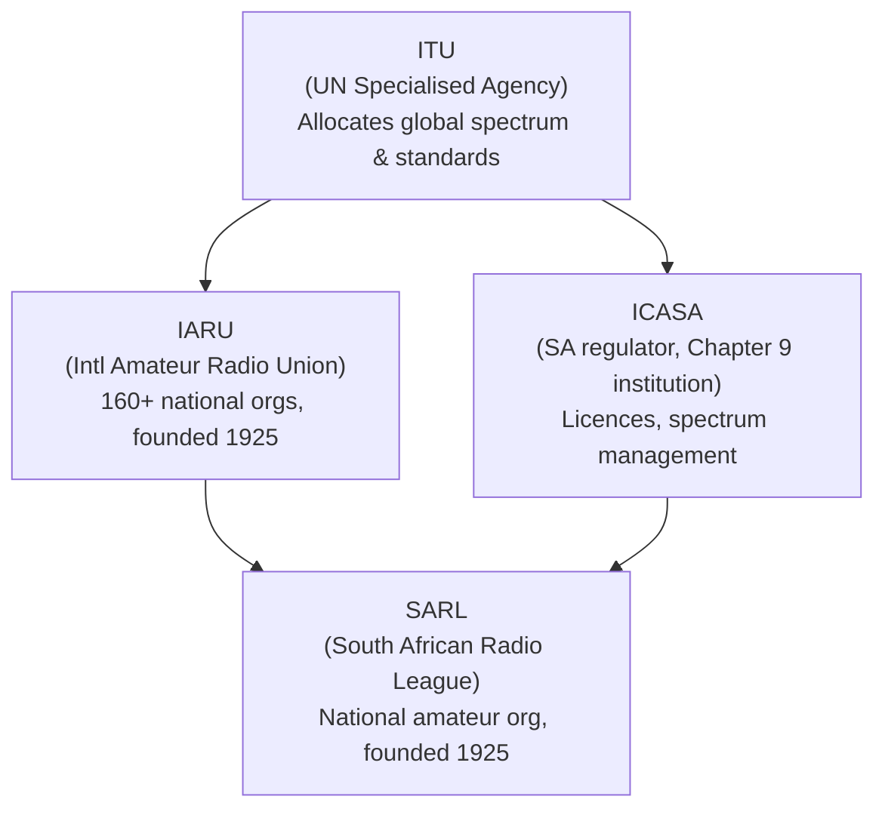
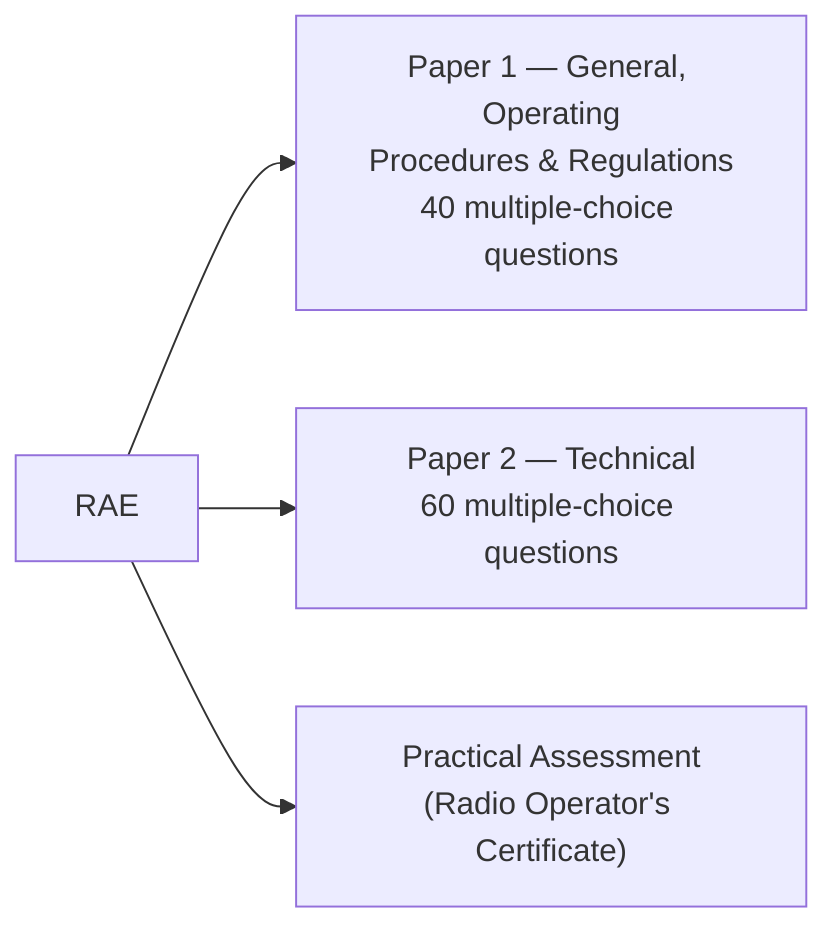

# Chapter 1: Overview of Amateur Radio

Amateur radio — also known as "ham radio" — is a hobby built around experimenting with radio technology for education, personal communication, and public service. This chapter covers the breadth of activities available to radio amateurs, the governance structures that regulate the hobby, and the licence requirements and restrictions that apply in South Africa.

---

## What Amateur Radio Actually Is

A **radio amateur** (or "ham") is a licensed individual who transmits and receives radio signals for non-commercial purposes. The hobby spans a huge range of activities — from chatting with a neighbour on VHF to bouncing signals off the moon.

A **transceiver** is the combination of a transmitter and a receiver in one unit. Handheld transceivers cover local ranges; small portable transceivers can achieve worldwide communication with the right antenna.

**Modes** describe how information is encoded onto a radio signal:

- **CW (Continuous Wave)** — the original mode; the signal is switched on/off in Morse code.
- **Phone** — speech-based modes: FM, AM, and SSB (Single Sideband).
- **Digital modes** — FSK, PSK, WSPR, WSJT, SSTV, etc. Allow text and image transmission.

An amateur radio contact is called a **QSO**. A brief contact can last seconds; a long conversation is a **rag-chew**. When two stations agree to meet at a specific time and frequency, that arrangement is called a **sked** (schedule). A **net** is a regularly scheduled group gathering on a specific frequency.

---

## Key Activities in the Hobby

**DXing** — contacting stations as far away and as varied as possible, often for awards. "DX" is the telegraphy shorthand for "distance." The premier award is the **DXCC** (DX Century Club), requiring confirmed contacts with at least 100 countries.

**DXpeditions** — expeditions to rare or remote locations to activate them for DXers.

**Contests** — timed competitions to contact as many stations as possible.

**Satellite communications** — the amateur community has launched over 100 small communications satellites (and some use the moon itself as a passive reflector — called EME or "moonbounce").

**RaDAR** (Rapid-Deployment Amateur Radio) — portable, rapid-setup operation from the field. Pioneered in South Africa by Eddie Leighton ZS6BNE.

**Public service and emergency communications** — amateurs provide communications backup for events, disasters, and remote expeditions. In South Africa, **Hamnet** (a SARL special interest group) coordinates emergency comms.

---

## QSL Cards and Electronic Confirmation

After a QSO, amateurs send a **QSL card** — a postcard confirming the contact details (date, time, frequency, mode, callsign). QSL cards are required to claim most awards.

Electronic alternatives include:
- **Logbook of The World (LoTW)** — the most important system, used for award credits.
- **eQSL.cc** — popular, includes picture support.
- **SA-QSL** — SARL's local electronic confirmation system.

---

## Governance of Amateur Radio

Amateur radio is regulated at multiple levels. The key organisations form a hierarchy from international treaty body down to the national club.

**ITU** (International Telecommunication Union) — the UN agency that globally allocates radio spectrum and satellite orbits. Founded 1865. Every national regulator is a signatory.

**ICASA** (Independent Communications Authority of South Africa) — the South African regulator, a Chapter 9 constitutional institution. Licenses broadcasters, manages the radio spectrum, enforces regulations. Is a signatory to the ITU.

**IARU** (International Amateur Radio Union) — worldwide federation of 160+ national amateur radio organisations. Represents amateur radio interests at the ITU. South Africa falls under ITU/IARU Region 1.

**SARL** (South African Radio League) — the national body. A non-profit, membership association. Founding member of IARU. Manages RAE administration on behalf of ICASA, advocates on spectrum matters, publishes *Radio ZS*, runs Hamnet, and supports licensing.

!!! note "Who actually issues licences?"
    The SARL administers the RAE and liaises with ICASA, but **ICASA is the sole authority** that issues licences and assigns callsigns. The SARL manages the licence on behalf of each holder after it is issued.

---

## Callsigns

Every amateur station has a unique **callsign** used to identify every transmission. South African callsigns follow the format:

**Prefix + Region digit + Unique letters**

| Component | Meaning |
|---|---|
| `ZR` / `ZS` | Class A licence (unrestricted) |
| `ZU` | Class B licence (restricted) |
| `ZT` | Special/club callsigns |
| Digit `1`–`9` | Region (e.g. `1` = Western Cape) |
| Letters `AN` | Unique station identifier |

Example: **ZS1AN** = Class A, Western Cape, unique identifier AN.

---

## Licence Classes

**Class A (ZR or ZS)** — full privileges on all frequency bands. Requires passing the full RAE and a practical assessment. Internationally recognised under the **CEPT agreement** (allows operating in EU, USA, Canada, Australia, NZ and others with simple paperwork). Based on the **HAREC** syllabus.

**Class B (ZU)** — entry-level licence for under-20s. Restricted HF/VHF privileges, max 100 W SSB. Lapses at the holder's 25th birthday.

---

## The Radio Amateur Examination (RAE)

Held twice a year — third Saturday of **May** and **October**. Administered by the SARL on behalf of ICASA.

!!! warning "Pass requirements"
    Minimum **50% per paper** AND an **overall mark of 65%**. You can rewrite a single failed paper at the next sitting, but the combined mark must still reach 65%.

On passing, Class A candidates receive a **HAREC** (Harmonised Amateur Radio Examination Certificate) — internationally recognised. The **Radio Operator's Certificate** (from the practical) is required by ICASA to operate.

---

## Restrictions on Amateur Transmissions

The Radio Spectrum Regulations prohibit the following on an amateur station:

1. Broadcasting (it's one-on-one communication, not a radio station).
2. Music, except under very specific conditions.
3. Advertising products or services.
4. Transmitting messages for payment.
5. Sending business messages that could use public telecoms.
6. Indecent, offensive, obscene, threatening, or racist content.
7. **Third-party traffic** (messages from non-operators), except during an emergency.

!!! note "Third-party traffic"
    In normal operation, only the licensed amateur operating the station may originate messages. During an emergency this restriction is lifted.

---

## Key Takeaways

- Amateur radio covers a wide range of activities: communication, DXing, contests, satellites, emergency comms, and homebrewing equipment.
- The hobby is regulated by ITU (global) → ICASA (SA national regulator) and IARU → SARL (SA amateur body).
- ICASA issues licences and callsigns; the SARL administers the RAE on ICASA's behalf.
- Class A (ZS/ZR) gives full privileges and international recognition via CEPT/HAREC; Class B (ZU) is restricted and expires at 25.
- The RAE is twice yearly (May and October): two written papers + a practical. Pass threshold is 50% per paper and 65% overall.
- Transmissions are heavily restricted: no broadcasting, no advertising, no third-party traffic (except emergencies).

---

## Open Questions

- What exactly is SSB (Single Sideband) and why is it the dominant HF phone mode?
- How does propagation work — why can't two stations always hear each other even on the right frequency?
- What does CEPT paperwork actually involve when operating abroad?
- What are the specific conditions under which music may be transmitted?
