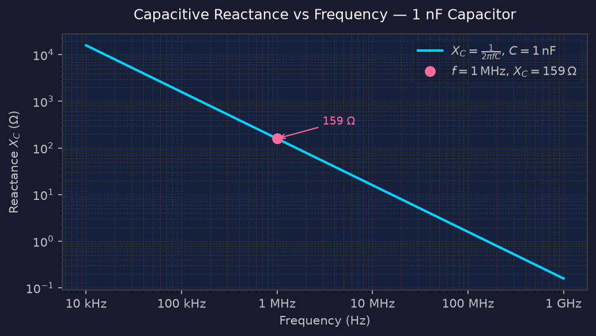

The capacitor — two conductors separated by an insulating dielectric — stores energy in an electric field rather than dissipating it as heat. In a DC circuit it charges until its plate voltage equals the source voltage and then blocks further current. In AC circuits it passes current continuously, forever cycling through charge, discharge, and polarity reversal. Understanding capacitance is foundational to filter, oscillator, and tuning-circuit design.

## The Capacitor

A **capacitor** consists of two conductive plates separated by an insulating material called the **dielectric**. The property describing its ability to store energy in the electric field between the plates is called **capacitance**, measured in **farads** (`F`). Practical values range from 1 `pF` to 1000 `µF` or more. Because the `µ` symbol caused printing difficulties, the abbreviation `MFD` is often stamped on physical components.

Three factors determine capacitance value:

- **Plate area** — greater area → more capacitance.
- **Plate separation** — closer plates → more capacitance.
- **Dielectric constant** — a material property of the insulator; higher constant → more capacitance. Vacuum has a dielectric constant of 1; air is very close to 1.

### Charging and discharging

When a capacitor is connected to a DC source, one plate loses electrons (becomes positive) while the other gains electrons (becomes negative). This continues until the voltage across the plates equals the source voltage — the capacitor is **fully charged** and current drops to zero. The energy is held in the electric field.

Reconnect the capacitor to a load instead, and the stored charge drives current through the load until both plates return to neutral — the capacitor is **discharged**.

!!! note "Energy storage, not dissipation"
    A capacitor stores energy in an electric field and returns it to the circuit intact. This differs fundamentally from a resistor, which converts energy to heat. The power formula $P = VI$ applies during charging, but the net energy delivered over a full charge–discharge cycle is zero.

## Capacitors in AC Circuits

With an AC source, the capacitor charges, discharges, and recharges with reversed polarity on every cycle — so current flows continuously. How much current flows depends on frequency:

- **Low frequency** — current flows in one direction for a long time, the capacitor charges appreciably, and the growing potential difference strongly opposes further current. Net current is small.
- **High frequency** — the direction reverses before significant charge accumulates. Little opposition develops and more current flows.

This frequency-dependent opposition is not resistance. A capacitor dissipates no power — it is called **capacitive reactance**.

## Capacitive Reactance

**Capacitive reactance** $X_C$ is the opposition a capacitor offers to AC current. It is measured in ohms (Ω) but — unlike resistance — no energy is dissipated. The formula is:

$$X_C = \frac{1}{2\pi f C}$$

where $f$ is frequency in Hz and $C$ is capacitance in farads.

The key trend: **reactance decreases as frequency increases.** A capacitor behaves like an open circuit at DC ($f = 0$) and approaches a short circuit at very high frequencies.

Ohm's Law applies using the magnitude of reactance:

$$I = \frac{V}{|X_C|}$$

**Worked example** — $C = 1\text{ nF}$ ($10^{-9}$ F) at $f = 1\text{ MHz}$ ($10^6$ Hz):

$$X_C = \frac{1}{2 \times 3{,}14 \times 10^6 \times 10^{-9}} = 159\ \Omega$$

$$I = \frac{1\ \text{V}}{159\ \Omega} = 6{,}3\ \text{mA}$$

The figure below shows how $X_C$ falls with increasing frequency for a 1 nF capacitor, with the worked-example point highlighted.

!!! warning "Reactance is not resistance"
    Both are measured in Ω, but they cannot be added directly. Combining resistance and reactance requires vector methods (covered in Chapter 11 on tuned circuits).

## Phase of Current and Voltage

In a capacitor, **current leads voltage by 90°**. The voltage across the capacitor lags the current through it by a quarter-cycle. This 90° phase shift is a defining property of all reactive components.

Because current and voltage are 90° out of phase, positive power in one quarter-cycle is precisely cancelled by negative power in the next. The capacitor "borrows" energy while charging and "returns" it while discharging — zero net power dissipated.

## Capacitors in Parallel and Series

Combining capacitors follows rules that are the *reverse* of resistors:

**Parallel** — equivalent to resistors in series:

$$C_{\text{Total}} = C_1 + C_2 + \ldots$$

**Series** — equivalent to resistors in parallel:

$$\frac{1}{C_{\text{Total}}} = \frac{1}{C_1} + \frac{1}{C_2} + \ldots$$

!!! note "Memory aid"
    Capacitors in parallel add directly — same rule as resistors in series. Capacitors in series follow the reciprocal rule — same pattern as resistors in parallel.

## Types of Capacitor

| Type | Typical range | Tolerance | Best suited to |
|---|---|---|---|
| Ceramic | 100 pF – 100 nF | ±10% | General RF bypass |
| Silvered mica | 1 pF – 100 nF | ±1% | Precision RF (filters, oscillators) |
| Polycarbonate | 10 nF – 10 µF | ±5% | Medium-precision AC circuits |
| Electrolytic | up to 100 F | moderate | DC power supply filtering |
| Variable | small–medium | — | Tuning circuits |

**Electrolytic capacitors** are **polarised** — one terminal must always remain positive relative to the other. Reversing polarity destroys them. They are best suited to DC applications such as power supply filtering, not RF circuits.

**Variable capacitors** consist of two sets of interleaved plates — a rotor that moves and a stator that is fixed. Rotating the shaft changes the overlap area, and therefore the capacitance. Variable capacitors were the original tuning mechanism in broadcast radio receivers.

!!! warning "Electrolytic polarity"
    Always observe the polarity marking on an electrolytic capacitor. Connecting one in reverse — even briefly — can cause it to fail, sometimes destructively.

## Key Takeaways

- A capacitor stores energy in an electric field between two conductive plates separated by a dielectric — no energy is dissipated.
- Capacitance depends on plate area, plate separation, and the dielectric constant of the insulating material.
- Capacitive reactance $X_C = \frac{1}{2\pi f C}$ decreases with increasing frequency — opposite to the trend for resistance.
- Current leads voltage by 90° in a capacitor; no net power is dissipated over a complete cycle.
- Capacitors in parallel add directly; capacitors in series follow the reciprocal rule — the reverse of resistors.
- Electrolytic capacitors are polarised and suited only to DC applications; ceramic and silvered-mica types serve RF work.

## Open Questions

- How are resistance and reactance combined when both are present in the same circuit?
- What determines the voltage rating of a capacitor, and what happens if it is exceeded?
- Why does a variable capacitor's tuning range depend on both minimum and maximum plate overlap?
- How does the dielectric material affect both capacitance value and the maximum safe voltage?
